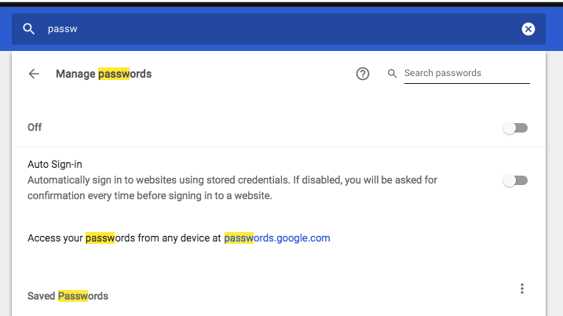

# README

This repo is for checking passwords that have been pwned using https://api.pwnedpasswords.com and 
`github.com/mattevans/pwned-passwords`

It so happens like everyone else I have had set of passwords that I have 
used often and would like to know which ones are common and have been pwned.

I used the exported chrome passwords to check how weak they are 

 
